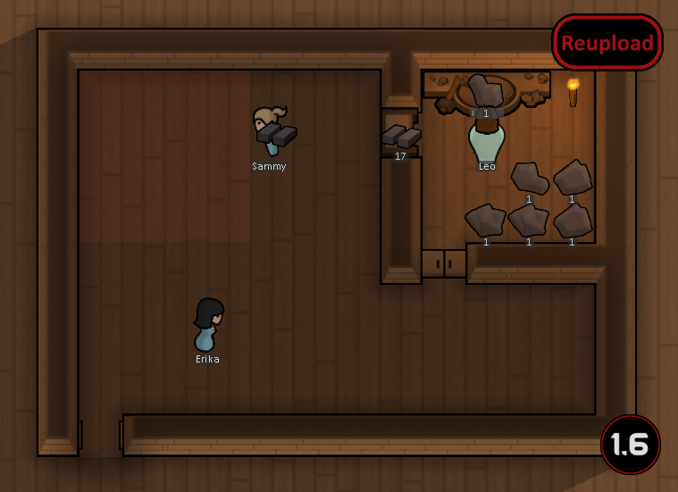

# RimWorld mod - Inwall Shelf

## Information
Allow colony to build shelf on a wall (or shelf acts as wall)

### Version:
| Rimworld | Mod |
| --- | --- |
| B19 | 1.0 |

## Features
Add a single-tile shelf that can be installed on wall.
Compatible with mods that add/modify/interact vanilla shelf.

## F.A.Q.
### Can I install this on existing colonies?
Yes.
### Are the stored items accessible from both sides?
Yes.
### License info
[MIT](LICENSE)  
Code is derived from Ludeon Studio, and [RimFridge](https://github.com/KiameV/rimworld-rimfridge)  
Texture taken from [Kitchen-Counter mod](https://github.com/Tammabanana/Kitchen-Counter/releases), which is from CuproPanda's CorePanda mod.
